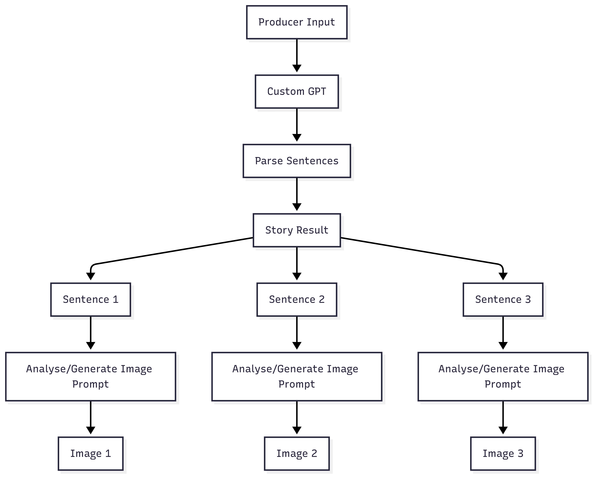
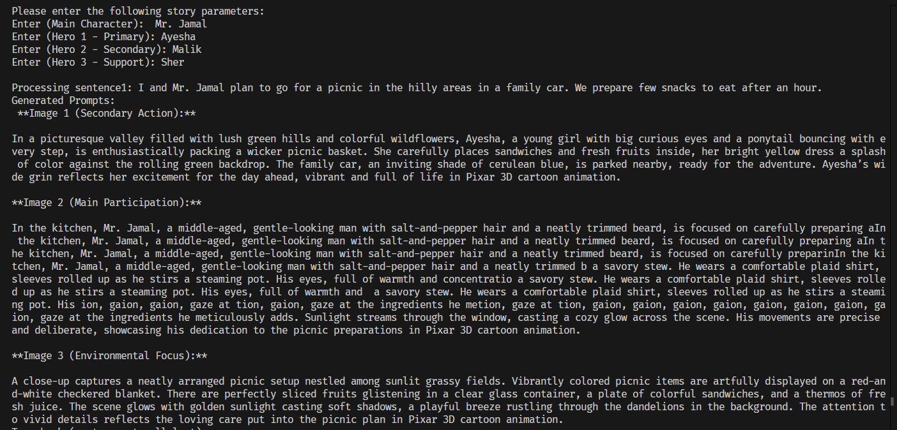
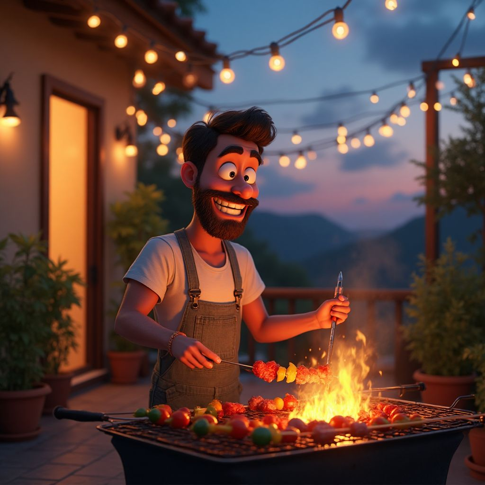

# Visual Tales Generator

The Visual Tales Generator is designed to transform narrative text into sequential visual storyboards, offering content creators and storytellers an automated platform for visual narrative generation.

## Table of Contents

- [Introduction](#introduction)
- [System Architecture Flow](#system-architecture-flow)
- [Story Processing Pipeline](#story-processing-pipeline)
- [Image Generation System](#image-generation-system)
- [Key Features](#key-features)
- [Data Structures Used](#data-structures-used)
- [Advantages of Using AI Visual Storytelling Engine](#advantages-of-using-ai-visual-storytelling-engine)

## Introduction

The Visual Tales Generator facilitates automated conversion of written narratives into visual storyboards, providing content creators with an AI-powered tool for sequential image generation. The system operates through two main processing stages:

## System Architecture Flow

  
   
  <em>Complete processing pipeline from input (a sentence in the <a href="./input_sentence.json">input_sentence.json</a>) to final image generation</em>

## Story Processing Pipeline

The story processing begins when users provide narrative input through a JSON file. The user's story content is analyzed and expanded using GPT-4 AI processing. Following are the functionalities within the story processing pipeline:

### **Complex AI Story Expansion**

- **Description**: Transform user input into complete 3-sentence narratives.
- **Functionality**: Takes initial story concepts and expands them into full narrative structures using OpenAI GPT-4. The system analyzes character relationships, plot progression, and thematic elements to create coherent storytelling sequences.
- **Example**:

  
   
  <em>AI agent processing story parameters and generating sequential image prompts with character consistency across all three scenes</em>

### **Element Extraction & Analysis**

- **Description**: Identify key narrative components in each sentence.
- **Functionality**: Automatically extracts characters (main, secondary), settings, actions, emotions, and objects from each story sentence. This analysis ensures comprehensive understanding of narrative elements for accurate visual representation.

### **Narrative Structure Optimization**

- **Description**: Organize story elements for visual sequencing.
- **Functionality**: Structures extracted elements into logical progression patterns, ensuring each sentence flows naturally into the next for optimal visual storytelling.

## Image Generation System

The image generation system processes the analyzed story content and creates sequential visual representations. The system is optimized specifically for Flux Dev model integration. Following is the functionality within the image generation system:

### **Sequential Prompt Generation**

- **Description**: Create Flux-optimized prompts for each story segment.
- **Functionality**: Generates three distinct prompts per sentence following a structured narrative sequence:
  - **Image 1**: Secondary character and action (establishing shot)
  - **Image 2**: Main character action or participation (focus shot)
  - **Image 3**: Environmental/object focus excluding main characters (detail shot)

**Example**: 
Following images were generated for the input sentence: 
"In the evening, we made bar b que and took a cup of tea."

  <table>
    <tr>
      <td align="center">
         
        <em>Secondary Character Action</em>
      </td>
      <td align="center">
         
        <em>Main Character Participation</em>
      </td>
      <td align="center">
         
        <em>Environmental Focus</em>
      </td>
    </tr>
  </table>

### **Flux Model Integration**

- **Description**: Generate high-quality images using Flux Dev through Replicate API.
- **Functionality**: Processes optimized prompts through Flux diffusion model with specific parameters for style consistency, camera angles, lighting variations, and character outfit continuity.

### **Quality Assurance & Consistency**

- **Description**: Maintain visual coherence across image sequences.
- **Functionality**: Ensures character consistency, environmental continuity, and narrative flow across all generated images. Implements parameter extraction system for dynamic character management throughout the story progression.

### **Output Management**

- **Description**: Organize and save generated visual content.
- **Functionality**: Systematically saves generated images with clear naming conventions, maintains quality standards, and provides organized output structure for easy access and review.

## Key Features

**Story Expansion**: Transforms simple user input into complete 3-sentence narratives using advanced AI processing.

**Element Analysis**: Automatically identifies characters, settings, actions, emotions, and objects from story content.

**Sequential Generation**: Creates three contextually-linked images per sentence showing step-by-step narrative progression.

**Flux Optimization**: Specifically engineered prompts for maximum Flux Dev model performance and quality output.

**Character Consistency**: Maintains visual character continuity across multiple image sequences through parameter management.

**Environmental Continuity**: Preserves setting details, lighting conditions, and atmospheric elements throughout story progression.

**Flexible Input**: Accepts variable sentence count in JSON format, processing any number of story segments provided.

**Professional Output**: Generates cinema-quality Pixar-style 3D cartoon imagery suitable for commercial storytelling applications.

## Data Structures Used

**JSON Processing**: Used for storing and managing story input data with flexible sentence count support for dynamic story length handling.

**Dictionary/Map Structures**: Used for storing extracted story elements (characters, settings, actions) for efficient retrieval and parameter management.

**List/Array Processing**: Used for managing sequential prompt generation and maintaining order of narrative progression across image sequences.

**String Manipulation**: Used for complex prompt engineering and parameter extraction to ensure Flux model compatibility and optimization.

**API Response Handling**: Used for processing OpenAI GPT-4 responses and Replicate API image generation results with error handling and quality assurance.

## Advantages of Using AI Visual Storytelling Engine

### **Efficiency & Automation**:

- Automated story expansion from simple user concepts
- Rapid sequential image generation without manual prompt creation
- Streamlined workflow from text input to visual storyboard completion

### **Professional Quality**:

- Cinema-grade visual output using state-of-the-art Flux Dev model
- Consistent character design and environmental details across sequences
- Pixar-style 3D cartoon aesthetic for engaging visual storytelling

### **Flexibility & Scalability**:

- Variable sentence count support for stories of any length
- Customizable character parameters and environmental settings
- Adaptable to different narrative styles and storytelling approaches

### **Technical Excellence**:

- Advanced prompt engineering optimized specifically for Flux model performance
- Intelligent character consistency management across multiple image generations
- Professional parameter handling for lighting, camera angles, and visual composition

### **User-Friendly Operation**:

- Simple JSON input format for easy story submission
- Automated processing pipeline requiring minimal technical knowledge
- Clear output organization with systematic file naming and directory structure
